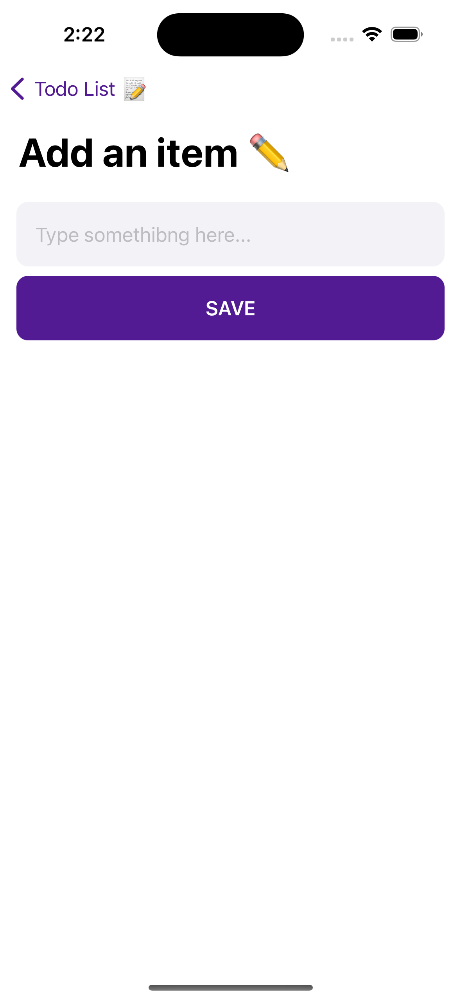

# SwiftfulThinkingTodoListMVVM 📝

Welcome to the **SwiftfulThinkingTodoListMVVM** app! This project is a simple yet powerful Todo List application built using SwiftUI and the MVVM (Model-View-ViewModel) architecture. The app allows users to manage their tasks efficiently by adding, updating, and deleting items from their Todo List.

## 📺 Tutorial

This app was created following the tutorial series **[SwiftUI Todo List Beginners Level](https://www.youtube.com/watch?v=wEf1YS4vyW8&list=PLwvDm4VfkdpheGqemblOIA7v3oq0MS30i&pp=iAQB)**. The tutorial covers the basics of SwiftUI and MVVM architecture, focusing on building the main screens where users can manage their Todo List.

## 🚀 Features

- **Add Items**: Easily add new tasks to your Todo List.
- **Update Items**: Mark tasks as completed or pending.
- **Delete Items**: Remove tasks that are no longer needed.
- **MVVM Architecture**: Clean separation of UI and business logic.

## 🛠️ Technologies Used

- **SwiftUI**: For building the user interface.
- **MVVM Architecture**: For a clean and maintainable codebase.

## 📱 Screenshots




## 📖 Getting Started

1. Clone the repository:
    ```sh
    git clone https://github.com/yourusername/SwiftfulThinkingTodoListMVVM.git
    ```
2. Open the project in Xcode:
    ```sh
    open TodoListMVVM/TodoListMVVM.xcodeproj
    ```
3. Build and run the app on the simulator or your device.

## 🤝 Contributing

Contributions are welcome! Feel free to open an issue or submit a pull request.

## 📄 License

This project is licensed under the MIT License.

---

Happy coding! 🎉